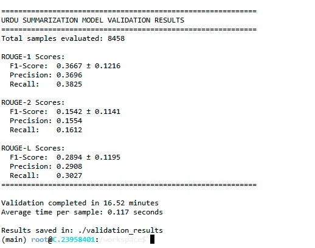

# Urdu Abstractive Text Summarization using mT5-Base

A deep learning model for abstractive text summarization 
in the Urdu language, built using Google's mT5-base 
transformer architecture. This project addresses the 
challenge of low-resource NLP for Urdu — one of the 
most widely spoken languages with limited AI tooling.

---

## 🔍 Project Overview

Traditional summarization tools fail for Urdu due to 
limited training data and right-to-left script complexity. 
This model was fine-tuned specifically on Urdu news and 
article datasets to generate concise, human-like summaries 
that preserve the core meaning of the original text.

---

## 🧠 Model Architecture

- **Base Model:** Google mT5-base (Multilingual T5)
- **Task:** Abstractive Text Summarization
- **Language:** Urdu (اردو)
- **Framework:** PyTorch + HuggingFace Transformers
- **Training:** Fine-tuned on custom Urdu news dataset

---

## 📁 Project Structure

├── train_model.py          # Model training script
├── preprocessing.py        # Data preprocessing pipeline
├── mt5token.py             # Tokenization utilities
├── run_validation_mt5_base.py  # Validation and evaluation
├── final_result_mt5.jpg    # Final results screenshot
├── mT5_model bar,line,radar chart.png  # Performance charts
├── mt5_professional_workflow.png       # Model workflow diagram
└── README.md

---

## ⚙️ Installation

pip install transformers torch sentencepiece datasets

---

## 🚀 How to Use

# Step 1 - Preprocess your data
python preprocessing.py

# Step 2 - Train the model
python train_model.py

# Step 3 - Run validation
python run_validation_mt5_base.py

---

## 📊 Results

---

## 🔄 Workflow

.png)

---

## 🛠️ Tech Stack

- Python 3.x
- HuggingFace Transformers
- mT5-base Multilingual Model
- PyTorch
- SentencePiece Tokenizer
- Google Colab / GPU Training

---

## 👨‍💻 Author

**Abdur Rehman**  
AI & ML Engineer | NLP Specialist  
7+ Years Experience in AI Development  
[Upwork Profile](https://www.upwork.com/freelancers/~01aaa1b5dbb9b181ee?mp_source=share)

---

## 📄 License

This project is licensed under the MIT License.
